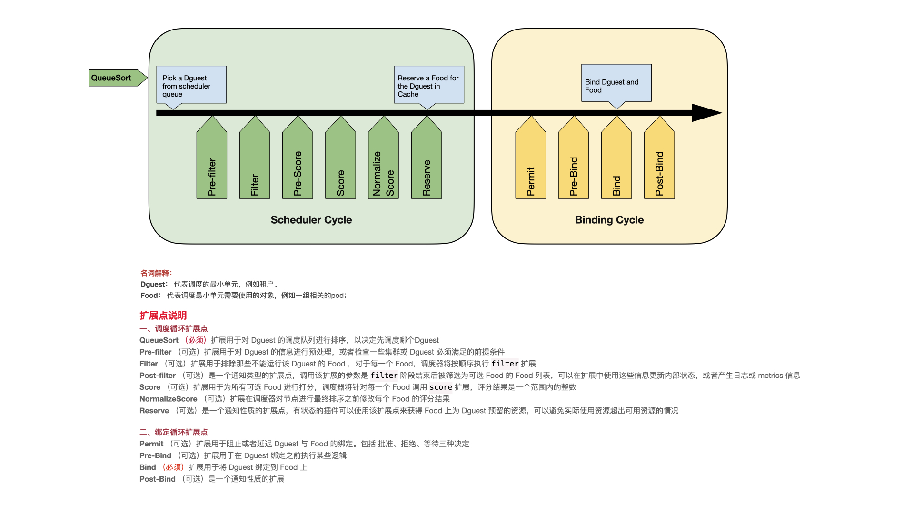

# Dguest Scheduler

  

## Explanation of Ranking

* Dguest：Represents the smallest scheduling unit, such as a tenant.

* Food: Objects that represent the use of a Dguest, such as a set of related Pods.

## Extension point Description

### Scheduler Cycle

* QueueSort: Necessary. The extension is used to sort the queue of Pods to be scheduled to determine which Pod to schedule first.
* Pre-filter: Extensions are used to preprocess information about a Pod, or to check some preconditions that a cluster or Pod must meet.
* Filter: The extension is used to exclude nodes that cannot run the Pod, and for each node, the scheduler executes the filter extension in order; If any filter marks the node as not optional, the remaining filter extensions will not be executed. The scheduler can perform filter extensions on multiple nodes at the same time.
* Post-filter: A notification type extension point that is invoked with a list of nodes that have been filtered to optional nodes after the filter phase, which can be used in the extension to update internal status or generate logging or metrics information.
* Score: The extension is used to score all the optional nodes, and the scheduler calls the "t" extension for each node, with the score being an integer within the range. In the normalize scoring phase, the scheduler will combine the scores of each scoring extension on a specific node with the weight of that extension as the final score.
* Normalize scoring: The scoring result of the scoring extension in the same plugin will be obtained as the scoring result of the scoring extension in the same plugin when the extension is called. The scoring result of the scoring extension in the same plugin will be modified before the final ordering of nodes by the scheduler. A normalize scoring extension in all plug-ins is invoked once.
* Reserve: Is a notification extension point that stateful plug-ins can use to get the resources reserved for Pod on the node. This event occurs before the scheduler binds the Pod to the node. The purpose of this event is to prevent the scheduler from scheduling a new Pod to the node while waiting for the Pod to bind to the node. The actual resources used exceed the available resources. Because binding a Pod to a node happens asynchronously. This is the last step in the scheduling process. After the Pod enters the reserved state, the Unreserve extension is either triggered when the binding fails, or the Post-bind extension ends the binding process when the binding succeeds.

### Binding Cycle

* Permit 
* Pre-bind
* Bind
* Post-bind
* Unreserve
